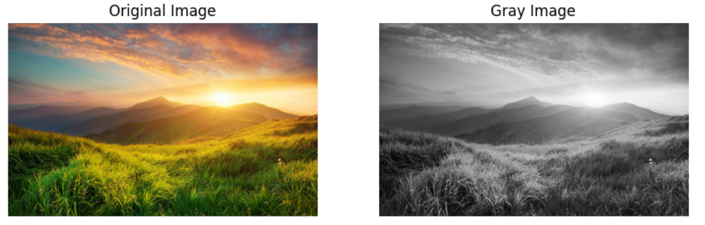
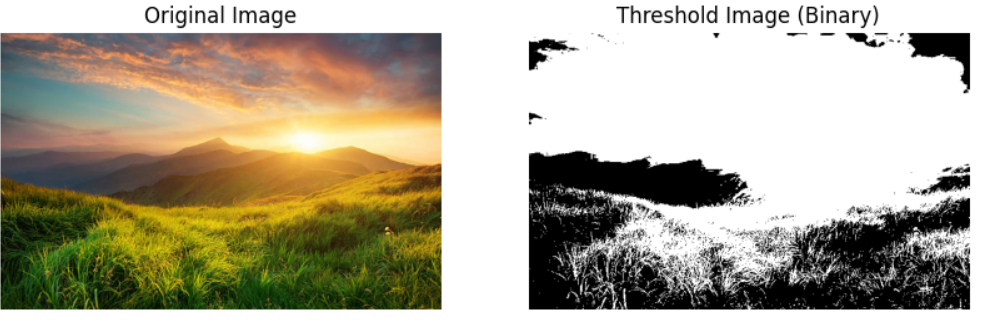
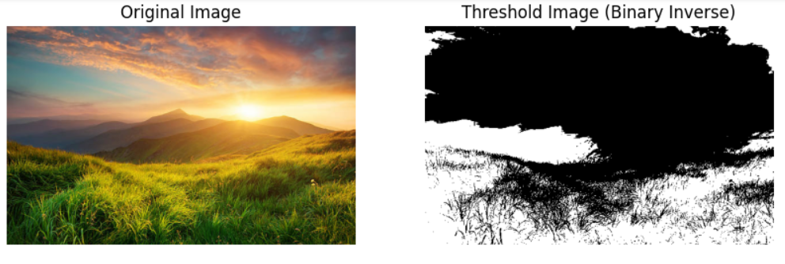
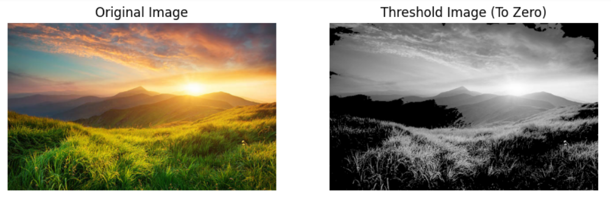
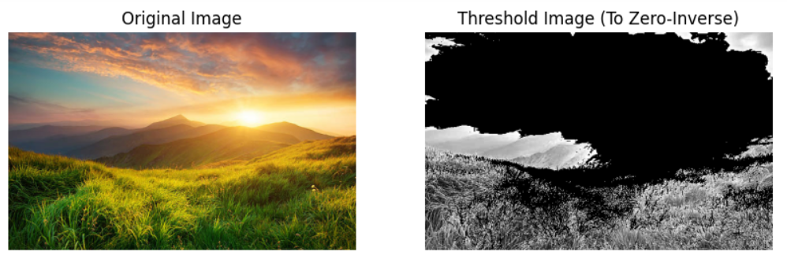
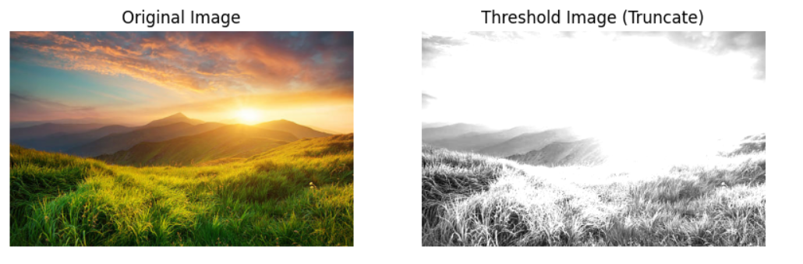
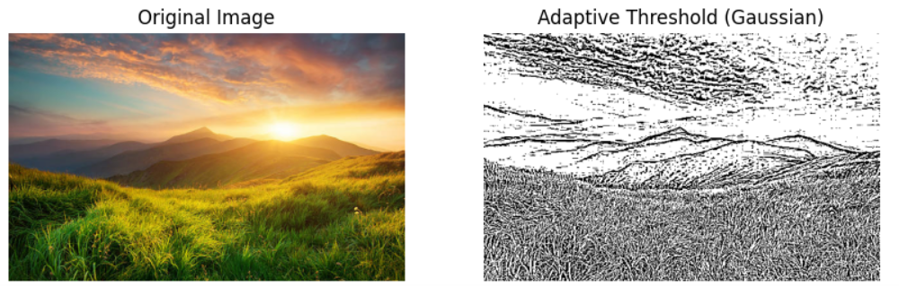
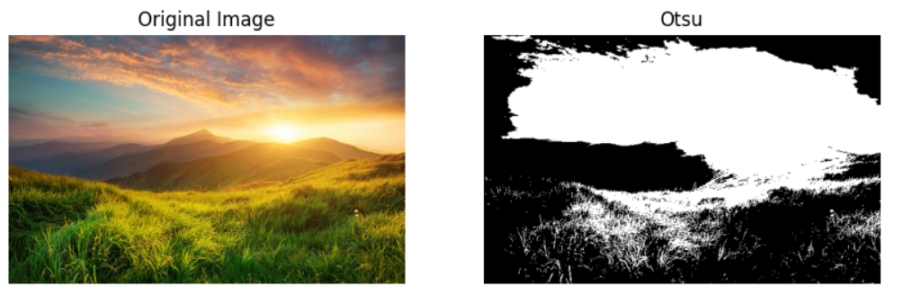

# THRESHOLDING
## Aim
To segment the image using global thresholding, adaptive thresholding and Otsu's thresholding using python and OpenCV.

## Software Required
1. Anaconda - Python 3.7
2. OpenCV

## Algorithm

### Step1:
Load the original image using cv2.imread() and convert it from BGR to RGB. Also, load the grayscale version of the image for further processing.

### Step2:
Apply different global thresholding methods like binary, inverse binary, to-zero, to-zero inverse, and truncate using cv2.threshold().


### Step3:
Use Otsu's method to automatically determine the threshold value and segment the grayscale image into foreground and background.

### Step4:
Implement adaptive thresholding (mean and Gaussian) using cv2.adaptiveThreshold() to handle varying lighting conditions in different parts of the image.

### Step5:
Use matplotlib to visualize the original image and the thresholded results side by side in subplots, with appropriate titles for each technique used.

## Program
```
import cv2
import numpy as np
import matplotlib.pyplot as plt

# Read the Image and convert to grayscale
image = cv2.imread("nature.jpg")  # Read the image using imread
image_rgb = cv2.cvtColor(image, cv2.COLOR_BGR2RGB)  # Convert the color from BGR to RGB
image_gray = cv2.imread("nature.jpg", 0)  # Grayscale image

# Use Global thresholding to segment the image
ret, thresh_dipt1 = cv2.threshold(image_gray, 86, 255, cv2.THRESH_BINARY)
ret, thresh_dipt2 = cv2.threshold(image_gray, 86, 255, cv2.THRESH_BINARY_INV)
ret, thresh_dipt3 = cv2.threshold(image_gray, 86, 255, cv2.THRESH_TOZERO)
ret, thresh_dipt4 = cv2.threshold(image_gray, 86, 255, cv2.THRESH_TOZERO_INV)
ret, thresh_dipt5 = cv2.threshold(image_gray, 100, 255, cv2.THRESH_TRUNC)

# Use Otsu's method to segment the image
ret, thresh_dipt6 = cv2.threshold(image_gray, 0, 255, cv2.THRESH_BINARY + cv2.THRESH_OTSU)

# Use Adaptive thresholding to segment the image
thresh_dipt7 = cv2.adaptiveThreshold(image_gray, 255, cv2.ADAPTIVE_THRESH_MEAN_C, cv2.THRESH_BINARY, 11, 2)
thresh_dipt8 = cv2.adaptiveThreshold(image_gray, 255, cv2.ADAPTIVE_THRESH_GAUSSIAN_C, cv2.THRESH_BINARY, 11, 2)

# Display the results
titles = ["Gray Image", "Threshold Image (Binary)", "Threshold Image (Binary Inverse)", "Threshold Image (To Zero)",
          "Threshold Image (To Zero-Inverse)", "Threshold Image (Truncate)", "Otsu", "Adaptive Threshold (Mean)",
          "Adaptive Threshold (Gaussian)"]

images = [image_gray, thresh_dipt1, thresh_dipt2, thresh_dipt3, thresh_dipt4, thresh_dipt5, thresh_dipt6, thresh_dipt7, thresh_dipt8]

for i in range(0, 9):
    plt.figure(figsize=(10, 10))
    plt.subplot(1, 2, 1)
    plt.title("Original Image")
    plt.imshow(image_rgb)
    plt.axis("off")
    plt.subplot(1, 2, 2)
    plt.title(titles[i])
    if i == 0:
        plt.imshow(images[i], cmap='gray')  # Display grayscale image
    else:
        plt.imshow(images[i], cmap='gray')  # Display thresholded images
    plt.axis("off")
    plt.show()

```
## Output

### Original Image


### Global Thresholding






### Adaptive Thresholding




### Optimum Global Thesholding using Otsu's Method



## Result
Thus the images are segmented using global thresholding, adaptive thresholding and optimum global thresholding using python and OpenCV is executed successfully.
